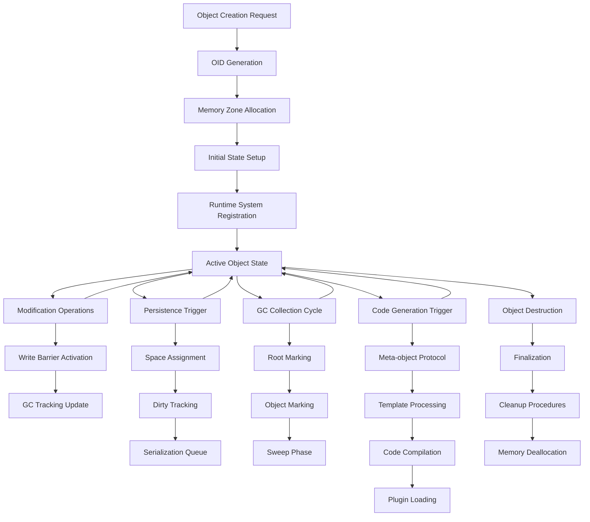

# RefPerSys Object Lifecycle Analysis

## Overview

This document provides a comprehensive analysis of object lifecycle and runtime behavior patterns in the Reflective Persistent System (RefPerSys). It maps the complete lifecycle of objects from creation through destruction, documenting critical integration points, timing dependencies, and subsystem interactions that enable developers to understand how objects behave throughout their existence in RefPerSys.

## 1. Object Creation & Initialization

### 1.1 OID Generation and Allocation

**Key Pattern**: Objects receive immutable OIDs (Object Identifiers) immediately upon creation.

```cpp
// OID generation using cryptographic-quality random generation
std::unordered_map<Rps_Id, Rps_ObjectZone*, Rps_Id::Hasher> 
    Rps_ObjectZone::ob_idmap_;

std::map<Rps_ObjectZone*> 
    Rps_ObjectZone::ob_idbucketmap_[Rps_Id::maxbuckets];
```

**Lifecycle Stage**: Creation → OID Assignment → Registry Registration

**Key Files**:
- `oid_rps.hh` lines 38-202: OID generation and validation
- Object creation in core object files

**Characteristics**:
- **Random Generation**: Uses `Rps_Random::random_64u()` for unique identifiers
- **Validation**: Ensures hash != 0 and within valid ranges
- **Space Distribution**: Spread across large address space to avoid collisions
- **Persistence**: OIDs serve as persistent identity across sessions

### 1.2 Constructor/Destructor Patterns

**Key Pattern**: Multi-stage object initialization with explicit cleanup procedures.

```cpp
class Rps_ObjectZone {
    Rps_Id _ob_oid;                    // Unique object identifier
    std::recursive_mutex* _ob_mutex;   // Per-object lock
    std::atomic<Rps_ObjectZone*> _ob_class; // Class reference (atomic for performance)
    // Attribute storage, components, payload...
};
```

**Constructor Sequence**:
1. OID allocation and validation
2. Memory zone allocation in GC-managed space
3. Mutex initialization for thread safety
4. Class reference assignment (atomic)
5. Registration with global object registry

**Destructor Sequence**:
1. Write barrier synchronization
2. Finalization cleanup
3. GC marking for dependent objects
4. Memory zone deallocation

### 1.3 Initial State Establishment and Validation

**Key Pattern**: Objects must establish valid initial state before becoming operational.

**Initial State Components**:
- **Attributes**: Key-value pairs for object properties
- **Components**: Child objects forming object relationships
- **Payload**: Type-specific data storage
- **Class Reference**: Link to object class definition

**Validation Requirements**:
- OID uniqueness verification
- Class reference integrity
- Memory zone allocation success
- Thread safety initialization

### 1.4 Registration with Runtime Systems

**Key Pattern**: Objects automatically register with multiple runtime systems upon creation.

**Registration Points**:
1. **Global Object Registry**: `ob_idmap_` for OID-based lookup
2. **Space Assignment**: Automatic placement in appropriate memory spaces
3. **GC Tracking**: Entry into garbage collection tracking system
4. **Symbol Table**: Optional registration in named symbol system

## 2. Active Object State Management

### 2.1 Reference Counting and Ownership Semantics

**Key Pattern**: Precise reference counting with write barrier integration for memory safety.

**Reference Management**:
- **Strong References**: Direct object pointers with GC tracking
- **Weak References**: Non-tracking references for circular reference handling
- **Atomic Operations**: Thread-safe reference counting using `std::atomic`

**Ownership Model**:
```cpp
// Allocated in GC-managed memory zones
// Each object has its own recursive mutex
// Immutable OID assigned at creation
```

**Key Characteristics**:
- **Thread Safety**: Each object has its own recursive mutex
- **Precise Tracking**: GC knows exact object layout and references
- **Multi-threaded Support**: Concurrent mutator thread support

### 2.2 Mutation Tracking and Write Barrier Integration

**Key Pattern**: Automatic mutation tracking through write barriers for incremental garbage collection.

```cpp
#define RPS_WRITE_BARRIER() \
    /* Called after object modifications */
    _.foo.RPS_WRITE_BARRIER()
```

**Mutation Tracking Process**:
1. **Write Barrier Activation**: Called after object modifications
2. **GC Notification**: Informs garbage collector of potential changes
3. **Incremental Support**: Enables non-blocking garbage collection
4. **Dirty Tracking**: Objects modified during dumping tracked by GC

**Integration Points**:
- Object attribute modifications
- Component relationship changes
- Payload data updates
- Class reference changes

### 2.3 Cross-thread Communication and Synchronization

**Key Pattern**: Multi-threaded object access with fine-grained locking.

**Synchronization Mechanisms**:
```cpp
class Rps_ObjectZone {
    std::recursive_mutex* _ob_mutex;   // Per-object lock
    std::atomic<Rps_ObjectZone*> _ob_class; // Class reference (atomic)
};
```

**Communication Patterns**:
1. **Per-object Mutexes**: Fine-grained locking for object access
2. **Atomic Operations**: Lock-free reads for class references
3. **Call Frame Integration**: GC-aware thread coordination
4. **Write Barriers**: Cross-thread mutation notification

### 2.4 Memory Zone Management and Allocation Patterns

**Key Pattern**: Zone-based allocation with different strategies for object types.

**Zone Architecture**:
- **Small Zones**: 8MB blocks for typical objects
- **Large Zones**: 64MB blocks for complex objects
- **Type-specific Allocation**: Different strategies for objects vs values

**Allocation Patterns**:
```cpp
// Cheney-like copying for immutable values
// Tri-color mark-and-sweep for objects
std::atomic<Rps_GarbageCollector*> gc_this_;
std::atomic<uint64_t> gc_count_;
```

**Performance Optimizations**:
- Thread-local caches
- Lock-free allocation paths
- Memory zone reuse
- Fragmentation prevention

## 3. Persistence Integration

### 3.1 When Objects Become Eligible for Persistence

**Key Pattern**: Objects become persistent through explicit marking or automatic assignment.

**Persistence Triggers**:
1. **Explicit Marking**: Objects marked as persistent via REPL commands
2. **Space Assignment**: Objects automatically assigned to spaces based on creation context
3. **GC Integration**: Objects tracked by garbage collector with write barriers
4. **Root Object Registration**: System objects automatically persistent

**Eligibility Criteria**:
- Complete initialization
- Valid OID assignment
- No circular reference issues
- Space availability

### 3.2 Serialization Triggers and Checkpoint Coordination

**Key Pattern**: Coordinated serialization process with checkpoint integration.

**Serialization Workflow**:
```
Object Creation → GC Tracking → Space Assignment → Dumping Queue → 
JSON Serialization → Space File Writing → Manifest Update → Atomic Commit
```

**Key Stages**:
1. **Scan Trigger**: Objects discovered during dump scanning process
2. **Serialization**: Object contents converted to JSON format
3. **File Writing**: Atomic file operations with temporary suffixes
4. **Commit**: Files renamed to final names, ensuring consistency

**Checkpoint Coordination**:
- GC write barriers ensure consistency
- Multi-phase dumping with validation
- Rollback capability for failed operations

### 3.3 Dirty Tracking and Change Detection

**Key Pattern**: Efficient change tracking to minimize serialization overhead.

**Dirty Detection Mechanisms**:
- **Write Barrier Integration**: Automatic detection of modifications
- **Incremental Dumps**: Only save changed objects
- **Object Hashing**: Track structural changes
- **Dependency Tracking**: Detect transitive changes

**Performance Optimizations**:
- Write barriers minimize GC impact during dumping
- Batching multiple objects together
- Lazy loading of complex object graphs
- Memory usage monitoring during loading

### 3.4 Recovery and Restoration Procedures

**Key Pattern**: Robust recovery procedures with validation and consistency checks.

**Recovery Process**:
1. **First Pass Loading**: Parse space files and create placeholder objects
2. **Root Object Initialization**: Link system objects to global registry
3. **Second Pass Loading**: Resolve object relationships and dependencies
4. **Validation**: Check consistency and completeness

**Key Functions**:
```cpp
void Rps_Loader::first_pass_space(Rps_Id spacid)
void Rps_Loader::initialize_root_objects(void)
void Rps_Loader::initialize_constant_objects(void)
```

**Consistency Checks**:
- Object count validation
- OID uniqueness verification
- Class reference validation
- Plugin availability checks

## 4. Garbage Collection Interaction

### 4.1 Root Identification and Marking Strategies

**Key Pattern**: Systematic root identification for accurate garbage collection.

**Root Marking Process**:
```cpp
void Rps_GarbageCollector::mark_gcroots(void) {
    // Mark root objects from global registry
    rps_each_root_object([this](Rps_ObjectRef obr) {
        this->mark_root_objectref(obr);
    });
    
    // Mark application-specific roots
    rps_garbcoll_application(*this);
    
    // Mark hardcoded root objects
    #include "generated/rps-roots.hh"
    
    // Mark hardcoded symbols
    #include "generated/rps-names.hh"
    
    // Mark constants
    #include "generated/rps-constants.hh"
}
```

**Root Categories**:
1. **Global Registry Roots**: System-wide accessible objects
2. **Application Roots**: Domain-specific root objects
3. **Hardcoded Roots**: Fundamental system objects
4. **Symbol Table Roots**: Named objects and constants
5. **Active Process Roots**: Running process references

### 4.2 GC-safe Access Patterns

**Key Pattern**: All GC-aware functions require explicit call frame parameters.

**GC Requirements**:
- **Frame Passing**: All GC functions need `Rps_CallFrame*` parameter
- **Periodic Collection**: `maybe_garbcoll()` called every few milliseconds
- **Write Barriers**: Called after object updates

**Safe Access Pattern**:
```cpp
Rps_Value operation(Rps_CallFrame* callingfra, /* params */) {
    RPS_LOCALFRAME(callingfra);  // Frame setup
    
    // GC-aware operations
    Rps_ObjectRef obj = allocate_object(/* ... */);
    obj->set_attribute(key, value);  // Automatic write barrier
    
    // Periodic GC check
    Rps_GarbageCollector::maybe_garbcoll();
    
    return result;
}
```

### 4.3 Finalization and Cleanup Procedures

**Key Pattern**: Multi-stage cleanup with proper finalization ordering.

**Finalization Sequence**:
1. **Write Barrier Synchronization**: Ensure all modifications are visible
2. **Object Marking**: Mark objects reachable from roots
3. **Sweep Phase**: Collect unreachable objects
4. **Memory Zone Cleanup**: Return memory to zone allocator

**Cleanup Procedures**:
- Recursive cleanup of object relationships
- Payload-specific cleanup routines
- Memory zone deallocation
- Lock and mutex cleanup

### 4.4 Memory Zone Coordination During Collection

**Key Pattern**: Coordinated collection across multiple memory zones.

**Zone Coordination**:
```cpp
void Rps_GarbageCollector::run_gc(void) {
    gc_running.store(true);
    Rps_QuasiZone::run_locked_gc(*this, [](Rps_GarbageCollector& gc) {
        Rps_QuasiZone::clear_all_gcmarks(gc);
        gc.mark_gcroots();
        Rps_PayloadSymbol::gc_mark_strong_symbols(&gc);
        
        while (!gc.gc_obscanque.empty()) {
            auto obfront = gc.gc_obscanque.front();
            gc.gc_obscanque.pop_front();
            obfront->mark_gc_inside(gc);
            gc.gc_nbscan++;
        }
    });
    
    Rps_QuasiZone::every_zone(*this, [](Rps_GarbageCollector& gc, Rps_QuasiZone* qz) {
        gc.gc_nbmark++;
        if (qz->is_gcmarked(gc)) return;
        delete qz;
        gc.gc_nbdelete++;
    });
    gc_running.store(false);
}
```

**Collection Phases**:
1. **Clear Phase**: Reset all GC marks across all zones
2. **Mark Phase**: Traverse from roots, marking reachable objects
3. **Sweep Phase**: Delete unmarked zones

## 5. Code Generation Workflow Integration

### 5.1 Object Modification Triggers for Code Generation

**Key Pattern**: Objects trigger code generation through meta-object protocol interactions.

**Generation Triggers**:
- **Class Modification**: Changes to object classes trigger regeneration
- **Method Updates**: Method additions/modifications trigger code generation
- **Module Updates**: Module objects trigger compilation
- **Generator Requests**: Explicit generation requests from generators

**Meta-object Protocol**:
```cpp
// Required attributes for code generation
- code_module: Reference to the module being generated
- include: Include file specifications
- generate_code: Generation parameters

// Required components processed for declarations and definitions
// Each component responds to messages:
- declare_cplusplus: Generate C++ declaration
- implement_cplusplus: Generate C++ implementation
- lightning_generate_code: Generate Lightning code
```

### 5.2 Generated Code Lifecycle and Object Interaction

**Key Pattern**: Generated code maintains bidirectional relationships with source objects.

**Code Generation Process**:
1. **Source Analysis**: Analyze objects requiring code generation
2. **Template Processing**: Apply templates based on object patterns
3. **Code Synthesis**: Generate C++/Lightning/JIT code
4. **Compilation**: Compile generated code to shared objects
5. **Loading**: Load compiled code as plugins

**Lifecycle Integration**:
- Generated objects trigger recompilation
- Code modifications update source objects
- Plugin lifecycle follows standard patterns
- Persistence integration preserves generated state

### 5.3 Plugin Extension Integration with Object Lifecycle

**Key Pattern**: Plugins integrate seamlessly with object lifecycle management.

**Plugin Integration Points**:
1. **Object Creation**: Plugins can create new classes and instances
2. **Code Generation**: Plugins extend generation strategies
3. **Persistence**: Plugin objects serialize with custom payloads
4. **GC Integration**: Plugin objects participate in garbage collection

**Plugin Lifecycle**:
```
Plugin Discovery → Plugin Loading → Symbol Resolution → 
Plugin Initialization → Object Registration → Runtime Integration
```

**Memory Management**:
- All plugin-allocated objects subject to garbage collection
- `RPS_LOCALFRAME` ensures proper stack rooting
- Cross-plugin object references automatically tracked

## 6. Visual Lifecycle Flow



## 7. Critical Timing Dependencies

### 7.1 Creation Timing Requirements

**Critical Dependencies**:
- OID generation must complete before registry registration
- Memory allocation must succeed before object initialization
- Class references must be resolved before object activation
- Mutex initialization must complete before multi-threaded access

### 7.2 Modification Timing Constraints

**Timing Constraints**:
- Write barriers must follow all object modifications
- GC checks must occur periodically (every few milliseconds)
- Lock acquisition must respect deadlock prevention rules
- Cross-thread operations must maintain consistency

### 7.3 Persistence Timing Windows

**Critical Windows**:
- Objects become eligible for persistence after complete initialization
- Serialization must occur during GC-safe periods
- Dumping processes require consistent object states
- Recovery procedures must validate timing-dependent relationships

### 7.4 GC Collection Synchronization

**Synchronization Points**:
- All mutator threads must enter GC-safe state
- Root marking must complete before object marking
- Sweep phase must not interfere with allocation
- Collection frequency balances memory usage vs. performance

## 8. Integration Points Between Subsystems

### 8.1 Object System ↔ Garbage Collector

**Key Integration Points**:
- Write barrier coordination
- Call frame integration
- Root identification
- Memory zone coordination

### 8.2 Object System ↔ Persistence Engine

**Key Integration Points**:
- OID preservation across sessions
- Dirty tracking for incremental dumps
- Space assignment and management
- Recovery validation

### 8.3 Object System ↔ Code Generation

**Key Integration Points**:
- Meta-object protocol implementation
- Generator object lifecycle management
- Template processing integration
- Plugin loading coordination

### 8.4 Object System ↔ Plugin System

**Key Integration Points**:
- Dynamic object creation
- Cross-plugin object references
- Plugin state persistence
- GC integration for plugin objects

## 9. Performance Implications

### 9.1 Memory Allocation Costs

**Allocation Patterns**:
- Zone-based allocation reduces fragmentation
- Thread-local caches minimize synchronization
- Lock-free paths for common operations
- Memory reuse through zone recycling

### 9.2 GC Performance Impact

**GC Optimization Strategies**:
- Generational collection exploits object mortality patterns
- Write barriers enable incremental collection
- Root marking is optimized for common cases
- Multi-threaded collection reduces pause times

### 9.3 Persistence Overhead

**Persistence Optimizations**:
- Incremental dumps reduce serialization costs
- Lazy loading minimizes startup overhead
- Batching improves I/O efficiency
- Caching reduces repeated operations

### 9.4 Code Generation Efficiency

**Generation Optimizations**:
- Template caching reduces generation time
- Incremental compilation updates only changed parts
- Plugin reuse avoids recompilation
- Multi-target generation sharing common infrastructure

## 10. Error Scenarios and Recovery Strategies

### 10.1 Creation Failures

**Failure Scenarios**:
- OID generation conflicts
- Memory allocation failures
- Initialization timeouts
- Registry registration errors

**Recovery Strategies**:
- Retry OID generation with different parameters
- Fallback to alternative memory allocation strategies
- Graceful degradation with reduced functionality
- Rollback partial initialization

### 10.2 Modification Errors

**Error Scenarios**:
- Deadlock situations
- Concurrent modification conflicts
- Write barrier failures
- Cross-thread synchronization errors

**Recovery Strategies**:
- Deadlock detection and resolution
- Optimistic concurrency with rollback
- Write barrier retry mechanisms
- Thread state synchronization recovery

### 10.3 Persistence Failures

**Failure Scenarios**:
- Serialization errors
- I/O failures during dump
- Incomplete recovery procedures
- Version compatibility issues

**Recovery Strategies**:
- Atomic dump operations with rollback
- Journaling for crash recovery
- Version migration tools
- Consistency validation and repair

### 10.4 GC Collection Errors

**Error Scenarios**:
- Collection cycle interruptions
- Memory corruption during collection
- Root identification failures
- Memory leak detection

**Recovery Strategies**:
- Cooperative GC with clean interruption
- Memory validation and repair
- Root identification retry mechanisms
- Leak detection and reporting

## Conclusion

The RefPerSys object lifecycle represents a sophisticated integration of multiple subsystems working together to provide persistent, garbage-collected, multi-threaded object management. Understanding these lifecycle patterns enables developers to:

1. **Debug Effectively**: Know where objects are in their lifecycle and what systems are involved
2. **Optimize Performance**: Understand the cost implications of different lifecycle operations
3. **Extend Safely**: Integrate new functionality without breaking lifecycle assumptions
4. **Design Robustly**: Build reliable systems that handle lifecycle transitions properly

This lifecycle analysis provides the foundation for understanding how objects behave throughout their complete existence in RefPerSys, enabling better system design, debugging, and extension development.